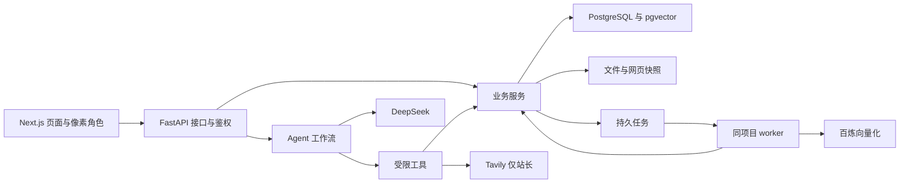

# 秋序技术设计基线

版本：v1.0 
日期：2026 年 10 月 5 日 
范围：前端、统一业务后端与 Agent、接口契约、数据库设计。本文给出工程设计基线；当前已实现第一版独立前端和明确标注的交互演示，后端业务与数据库迁移尚未实现。

## 阅读顺序

1. [前端设计](frontend.md)：页面、组件、状态和交互。
2. [后端与 Agent 设计](backend.md)：模块、鉴权、工具、任务和事务。
3. [接口契约](api-contract.md)：前后端共用的路径、字段与事件。
4. [数据库设计](database.md)：实体、字段、约束、索引与数据生命周期。
5. [产品方案](../product-plan.md)：产品范围和已确认要求。

接口的名字和事件以接口契约为准，字段存储和约束以数据库设计为准。代码实现后从 FastAPI 模型导出 OpenAPI，前端据此生成类型，避免手写三套定义。

## 已确定的产品约束

邮箱加密码登录；公开浏览免登录；AI 与留言需要登录。普通用户邮箱验证后冷却 24 小时，之后每天 10 次 AI 请求。联网搜索与网页抓取仅站长可用。支持公开网页、文本型 PDF、DOCX，首版不做 OCR 和旧版 DOC。

后端和 Agent 同项目；内容、收藏、聊天、日志默认永久保存；站长可通过助手修改公开范围与保存策略。部署暂缓。

## 本轮采用的工程选择

| 项目 | 设计基线 |
| --- | --- |
| 前端 | Next.js App Router、TypeScript、Tailwind CSS；业务完全由 FastAPI 处理 |
| 后端 | FastAPI、Pydantic、SQLAlchemy 2、Alembic |
| 数据 | PostgreSQL 加 pgvector；外部文件保存到独立存储目录 |
| Agent | LangGraph，LangChain 仅按模型或工具适配需要引入 |
| 服务 | DeepSeek 对话与工具调用；Tavily 搜索及提取；百炼向量化，可选重排序 |
| 登录会话 | 服务端会话加 HttpOnly Cookie；不把登录令牌放 localStorage |
| 站长额外验证 | 首版采用 TOTP，15 分钟有效，可配置；Passkey 后续可加 |
| 异步执行 | 同一后端项目中的 PostgreSQL 作业队列与 worker；首版不强制 Redis |
| 回复传输 | 提交请求取得 run_id，再用可重连的 SSE 获取事件 |
| 发布 | 私密原稿与显式选择的公开版本分开 |
| 额度窗口 | Asia/Shanghai 自然日，每日 00:00 重置 |

框架与库的精确版本在初始化依赖时锁定。DeepSeek 模型 ID、百炼接入地域和嵌入模型由配置确定；向量模型暂以固定 1024 维作为数据库设计基线。角色和色板通过前端主题配置切换，数据库不绑定阮梅或停云。

## 模块关系

前后端可独立开发与运行。浏览器统一调用同源 /api 路径，由转发层送到 FastAPI；Next.js 不再建立第二套业务、身份或 Agent 服务。

## 必须保持的约束

- 角色、user_id、工具权限和额度来自后端；客户端与模型不能自授权限。
- 管理表单与 Agent 调用同一个服务方法，具备同样的参数校验和审计。
- 公开 API 从公开版本取字段，不从私密版本取出后由前端隐藏。
- 公开内容撤回后，新的页面访问、检索、事件回放与模型上下文重新检查权限。
- 一次 ask 对应一个 run；网络重试、SSE 重连和内部工具步骤不会重复扣问答次数。
- 内容永久保存与会话凭据有效期是不同设置；认证凭据仍有过期时间。
- 所有外部调用的实际消耗单独记录；退还用户问答次数不抹掉已产生的成本。
- 文件读取、长模型调用和网页解析不占用长时间数据库事务。

## 实现顺序与交付检查

先完成账号与会话、资源与公开版本、问答任务与额度，再接入文档网页入库及模型；最后补全页面、角色状态和管理体验。每一步包含跨账号访问、重试幂等、权限撤回和失败恢复的验证。

当前前端实现、验证与后续对接见 [前端实现记录](frontend-implementation.md)。设计中的后端权限、事务、数据库、模型与邮件仍需实现及联合验收；前端演示不能替代这些能力。
