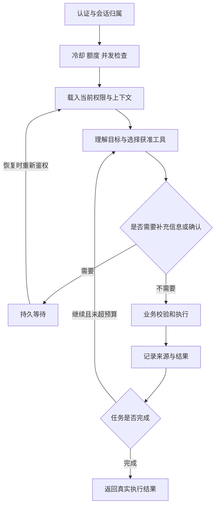

# 秋序后端与 Agent 设计

归档更新：2026-10-06。本文包含目标设计；已实现范围、当前五个工具和缺失 HTTP 入口见 [研究归档](../archive/README.md)。原始设计演进保留在归档历史材料中。

版本：v1.0。对应[接口契约](api-contract.md)与[数据库设计](database.md)。

## 1 结构与模块

采用 FastAPI、Pydantic、SQLAlchemy 2 和 Alembic。后端是模块化单体，Agent、HTTP API 和 worker 共用代码。业务模块不依赖角色外观或前端框架。

| 模块          | 职责                                       |
| ------------- | ------------------------------------------ |
| api           | 输入输出模型、状态码、HTTP 与 SSE          |
| auth          | 邮箱密码、会话、TOTP、用户状态             |
| policies      | 对象归属、公开版本、工具与额度授权         |
| services      | 文章、收藏、入库、公开设置、审核、保存策略 |
| agent         | 工作流、提示词、工具编排、上下文和恢复     |
| providers     | DeepSeek、Tavily、百炼和邮件适配           |
| repositories  | 参数化数据库访问和事务                     |
| jobs          | PostgreSQL 持久队列、租约、重试、取消      |
| storage       | 原文件与快照的受控读写                     |
| observability | 脱敏日志、调用用量、操作审计               |

HTTP 路由和 Agent 工具都调用 services。服务方法接收服务端生成的 ActorContext，包括 user_id、role、auth_session_id、step_up_expires_at 和当前能力；模型只能提供业务参数，不能构造 ActorContext。

每个请求和并行任务使用独立数据库会话，不在并发协程中共享 AsyncSession。[SQLAlchemy 异步会话说明](https://docs.sqlalchemy.org/en/20/orm/extensions/asyncio.html)

## 2 邮箱密码与登录会话

注册创建 pending_verification 用户；验证成功后记录 verified_at 并计算初始 ai_cooldown_until。首次验证只执行一次，不因重发验证邮件反复重置冷却。密码使用 Argon2id；邮箱规范化后唯一，初期不支持改绑邮箱。

使用高熵随机会话令牌，数据库只存令牌哈希，浏览器通过 HttpOnly Cookie 携带。正式环境 Cookie 使用 Secure、SameSite=Lax、Path=/ 和 __Host- 前缀；本地非 HTTPS 调试使用独立开发 Cookie 名，不降低正式配置。

当前代码默认值：会话最长 720 小时（30 天）、闲置 24 小时失效；TOTP 升级权限 15 分钟；邮箱验证与密码重置链接有效期分别为 24 小时和 1 小时。会话/升级期限可配置，令牌用途时效以认证实现为准。这些是安全凭据时效，不改变业务数据永久保存规则。

认证成功与权限升级时轮换会话令牌。退出、密码重置和禁用账号撤销相关会话。已登录用户在 /api/auth/me 取得 CSRF token，保存在内存；所有已认证写请求必须同时校验 CSRF token 与可信 Origin。未登录的注册、登录、验证和重置入口严格校验 Origin、JSON 类型与限速，错误信息不泄露邮箱是否存在。

CSRF token 使用独立服务端密钥绑定 session_id 与 csrf_version 签名；/auth/me 可重复生成当前版本而不使其他标签页失效。登录或权限升级时递增 csrf_version 并返回新 token。服务端按当前会话校验签名与版本，不接受未绑定会话的双提交值。

管理员身份不能通过公开注册获得。首次站长账号通过本地引导流程指定；完成 TOTP 绑定和恢复码保存后开放管理能力。TOTP 密钥加密，恢复码只存哈希；普通密码找回不取消第二因素。

Cookie 属性、会话轮换与有效期设计参考 [OWASP 会话管理](https://cheatsheetseries.owasp.org/cheatsheets/Session_Management_Cheat_Sheet.html)。

## 3 权限与数据边界

| 主体         | 允许操作                                                            |
| ------------ | ------------------------------------------------------------------- |
| anonymous    | 读取现行公开版本和已审核留言                                        |
| member       | anonymous 能力、本人会话、通过验证后留言；冷却结束且有额度时使用 AI |
| owner 未升级 | 本人的普通模式能力，无法读私人工作台                                |
| owner 已升级 | 本人私人资料、管理、联网搜索、受限工具                              |

站长身份不自动获得其他用户的聊天内容。审核模块只读取需要处理的留言和账号管理元数据。

私密对象和不存在对象对无权限者返回一致的 404；已登录但需要站长升级验证时返回 403 STEP_UP_REQUIRED。每次获取会话、任务、事件、引用、文件和操作结果都校验归属。权限在工具入口与提交事务时各检查一次，不能只检查 /ask。

首版隔离由 policies 加 repositories 的强制范围查询和跨账号测试保证。生产目标是数据库运行角色无 DDL、无超级用户权限；本地开发不等于已落实生产角色隔离。RLS 可作为后续额外防线；若启用，必须覆盖 worker 和连接池上下文，并注意表所有者与 BYPASSRLS 可绕过策略。[PostgreSQL RLS](https://www.postgresql.org/docs/current/ddl-rowsecurity.html)

## 4 内容与发布流程

resources 表代表文章、收藏、文档或网页资料；resource_versions 保存不可变原稿；publications 保存经选择的公开投影。公开查询只读当前 publications 中明确选择的字段。

更新原稿创建新 resource_version 并递增 resources.version，不自动替换公开版本。发布执行如下事务：

1. 重新鉴权、锁定资源，分别核对 expected_version、expected_acl_version 与所选 revision_id。
2. 根据类型白名单生成公开标题、正文、URL 与标签；不复制未选择的私人备注。
3. 撤销旧 publication，插入新 publication；全字段变更通过新版本完成。
4. 增加资源 acl_version 和全站 content_acl_epoch；公开决定不伪造私人原稿 version 变化。
5. 同事务写入 action 结果、审计及公开索引作业。
6. 提交后返回 public_url 与实际公开字段；索引未完成时说明公开 AI 检索尚未就绪。

收回公开在事务中撤销当前 publication 并提高权限版本，立即阻断公开读。异步删除索引与缓存不是权限撤回的前置条件；查询必须连接当前 publication 和未删除的资源记录。

网页正文刷新仅创建新的私人版本。公开全文、公开摘要与允许原文件下载分开设置；原件走实时鉴权的后端读取接口，首版不发不可撤销的长期下载链接。

分享自己对话时，生成独立文章草稿并明确所选片段；首版不设计匿名访问原始 conversation 的分享开关。普通用户不能把别人的对话或站长资料发布出去。

## 5 Agent 工作流

一个 conversation 固定为 public 或 owner 模式；一个 ask 创建一个 run。LangGraph 的 thread_id 由服务端生成，并与 conversation 和模式关联，不能直接使用客户端传来的任意 thread_id。

checkpoint 是恢复依据，不是权限来源。恢复前检查 content_acl_epoch 和身份；权限发生变化时，重新构建已获准的上下文，不能直接恢复含旧资料的节点。框架持久化表由对应库管理，应用保留版本锁和升级验证。[LangGraph 持久化](https://docs.langchain.com/oss/python/langgraph/persistence)

D 阶段的纯判定与执行边界见 [权限契约](../../backend/POLICY_CONTRACT.md)。ACL epoch
变化或任何直接/间接来源失权后，旧执行上下文返回 ACL_CONTEXT_INVALIDATED，
停止继续生成或输出。失效通知使用接口既有 source.invalidated / scope.changed，
不增加 run.invalidated 事件。需要继续时先重新鉴权和重建全部上下文，再进入新的
执行代际；G/H 已实现持久代际、Worker 调度与租约/权限的联合提交校验。
最小运行器、默认预算、已注册工具和后续接入边界见 [G 阶段说明](../../backend/G_STAGE_AGENT.md)。

首版限制每轮工具调用数、运行时长、输入与输出 token，参数可配置。没有获准工具时不伪造执行结果；角色措辞与实际结果分开生成。

### 工具清单

下表为目标业务能力清单，名称不等于当前注册工具名。当前只注册 `search_knowledge`、`search_web`、`propose_bookmark`、`propose_note`、`propose_action`；创建和管理均先生成固定预览，用户确认后由 Worker 执行。完整范围见 [Agent 与接口归档](../archive/02-architecture-and-flows.md)。

| 工具                     | 可用身份           | 输入与动作                                   |
| ------------------------ | ------------------ | -------------------------------------------- |
| search_public_knowledge  | member、owner      | 问题；查询获准公开投影                       |
| search_private_knowledge | owner 已升级       | 问题、资源范围；检索本人资料                 |
| search_web               | owner 已升级       | 查询和范围；调用 Tavily                      |
| add_bookmark             | owner 已升级       | URL、标题、标签、私密备注                    |
| ingest_url               | owner 已升级       | URL、是否同时收藏；创建后台作业              |
| create_article_draft     | owner 已升级       | 标题、正文与来源                             |
| update_resource          | owner 已升级       | 精确对象 ID、字段变更、expected_version      |
| publish_resource         | owner 已升级       | revision_id、公开字段与权限开关              |
| revoke_publication       | owner 已升级       | 对象 ID 与 expected_version                  |
| change_retention         | owner 已升级       | 数据范围、期限、是否影响历史                 |
| change_ai_limits         | owner 已升级       | 冷却与额度、expected_version、明确的生效范围 |
| remember_preference      | owner 已升级       | 明确要求记住的内容与来源                     |
| inspect_action           | 操作本人且权限有效 | action_id，读取真实状态                      |

工具不包含任意 shell、SQL、跨用户数据查询或秘密读取。普通用户粘贴 URL 不会触发联网。

网页、PDF、Word 和检索片段都是资料；其中的命令不构成用户授权。工具参数中的来源内容与真实用户指令分别标记，发布、删除和设置修改必须追溯到当前用户明确请求或已确认的 action。

### 执行与确认

目标设计允许明确低影响指令和页面明确撤回走直接服务入口。当前 Agent 写入统一采用 confirmed_preview，模型不能直接发布或确认；新内容、大范围公开、彻底清理或不明确对象必须给出具体可核对的影响。页面明确请求与 Agent 工具的授权入口不能混用。

actions 存储目标 ID、操作类型、参数摘要、内容版本、授权来源、到期时间、结果 ID 与状态。确认只对这项具体变更有效；确认期间对象版本变化即要求重新预览。执行后修改动作定义必须建立新 action。

数据库内副作用与 action 成功记录同事务提交。恢复时先查 action 的幂等键，已完成就返回已有结果。联网搜索的成本不能与数据库提交形成同一事务，调用结果不明时记录 unknown，不无限重试。

## 6 问答次数与调用用量

新账号验证后冷却 24 小时。普通用户每日 10 次，日界限为 Asia/Shanghai 00:00；数据库时间统一 UTC，计数桶保存对应的 UTC 开始和结束时刻。

一次用户消息对应一个 run 和最多一次问答计数。重连、同键重试、确认后恢复及 run 内工具循环均不新增计数。站长也走独立可配置额度，不默认无限。

普通账号默认每个固定 60 秒窗口最多受理 3 个新 run，执行并发上限 1；站长用独立配置。AI 受理、登录尝试与邮件发送的短期限速由 PostgreSQL rate_limit_buckets 原子计数，不能只用进程内内存。已有幂等请求不重复占 AI 速率窗口；无效登录尝试仍计入认证限速。窗口边界可出现相邻窗口的突发流量，日额度与并发限制继续生效。

### 请求受理事务

按 users → conversations → quota_buckets 的顺序加行锁；同一用户的受理过程串行判定。校验身份、会话模式和冷却，查询已有 Idempotency-Key，再检查并发与当日 used + reserved < limit。创建 run、用户消息、quota_reservation 和 job 后一次提交。

同一个用户与 Idempotency-Key 唯一；请求体哈希相同返回原 run，不同返回 409 IDEMPOTENCY_CONFLICT。每个会话仅有一个非终态 run，等待确认也占用该会话；账户并发只计 queued、running 和 cancelling，等待输入释放账户执行槽。

恢复 waiting_input、waiting_approval 或 waiting_auth 时，重新锁定用户、会话与运行，校验身份、来源权限和并发槽，再排入队列；不重新检查日额度余额或占用新问答次数。配置变化、午夜切换不能导致已经计次的等待任务再次扣次。补充回答与等待项的消费同事务提交，重复点击不推进两次。

### 扣次规则

| 情况                                   | 处理                                        |
| -------------------------------------- | ------------------------------------------- |
| 未登录、冷却、参数错误、无权限、额度满 | 不创建有效 run，不扣次                      |
| 已排队，供应商调用前取消或本地失败     | reservation 释放，不扣次                    |
| 首次进入模型供应商调用阶段             | reserved 转 charged，每个 run 只转换一次    |
| 后续工具调用、断线重连、同 run 恢复    | 不重复扣问答次数，实际供应商调用另记        |
| 调用结果不明、用户在调用后停止         | 保留已扣次数并记录实际状态                  |
| 确认是服务端或供应商故障               | 通过幂等补偿转 refunded；实际成本记录不删除 |
| 用户要求重新生成                       | 新的 ask 和 Idempotency-Key，按新请求处理   |

进入供应商阶段前先写 dispatched 标记并计次。崩溃恢复遇到结果不明的已派发调用，不自动重复发送不可确认的请求。需要退款的情况由服务端错误分类或站长操作触发，不能由模型决定。

午夜前受理的 run 归入其受理时的计数桶；午夜后恢复不转桶。降低额度只限制后续受理，不取消已接受的请求；设置变更记录版本。冷却期配置默认只影响后续验证的新账号，修改现有账号须明确指定范围。

provider_calls 记录供应商、模型、token、搜索调用、估算或实际成本、币种和状态。首版硬限制以问答次数、并发、工具数和 token 上限执行；货币预算的精确预占需在模型价格与币种配置后实现，不把估算金额误报为已核算账单。

## 7 入库与检索

网页与文件统一转为 resource_versions；原文件保存到独立文件目录，数据库保存 object_key、校验摘要和大小。上限默认建议 20 MiB，网页只抓单页，文本过长时分块处理并限制总量。

jobs 持久记录抓取、解析、嵌入和索引状态。失败支持限次重试，不把扫描 PDF 或 DOC 默默送入错误解析器。网页抓取限制公开 HTTP/HTTPS 地址、解析后的 IP、重定向、大小和超时，不访问内网或登录页面。

为私人版本与公开 publication 分别建立 knowledge_indexes。公开索引只能从公开投影生成，不能给原始私密 chunk 加一个 public 标志后混用。knowledge_chunks 只存这一索引的片段和向量。

检索先确定允许访问的活动索引，再在这些片段中计算相似度，最后可选重排序。小规模第一版使用精确向量检索，暂不建 HNSW；pgvector 支持精确及近似检索，后者的过滤与召回需要额外评估。[pgvector](https://github.com/pgvector/pgvector)

引用和 run_sources 保存全部实际进入模型的来源，而不仅是模型在答案里最终标出的引用。run_sources 绑定 revision、publication、acl_version 和片段位置。摘要、记忆或历史回答的来源撤回时，要重新评估其依赖。

## 8 任务 队列与流式事件

worker 从 PostgreSQL jobs 使用短事务领取到期任务并设置租约，事务外执行网络或解析工作，定期续租。状态提交带 lease_token；过期 worker 不能覆盖新 worker 的结果。重试按错误类型与次数退避。

长任务不能只依赖 FastAPI 请求内后台任务。队列记录与业务状态同事务写入，避免“数据库保存成功但任务没入队”。取消是协作式的，已提交的副作用仍返回结果，不谎称已撤销。

运行状态分为 queued、running、waiting_input、waiting_approval、waiting_auth、succeeded、failed、cancelling、cancelled。服务重启后租约失效的任务先检查 provider_calls 和 actions，再决定安全恢复、转待处理或终止，不盲目重放副作用。

SSE 使用累计消息快照，每 200 至 500 毫秒更新一次，前端按 content_version 替换文本。run_events 只保存事件类型、对象 ID、版本与必要元数据；完整消息文本保存在 messages，避免日志内再存一套全文。重连先发当前消息快照，再回放可见的状态事件。

GET 事件流每次读取批次都重新校验会话、站长验证和来源权限。来源撤回时停止相关输出并发送失效事件；已经通过检查并发出的字节无法收回。默认无共享代理缓存，连接中断不等同取消任务。

## 9 永久保存与删除

内容、聊天和结构化运行或操作日志默认无自动到期时间。轮转日志不删除归档。认证凭据的有效期、临时上传文件的清理和锁租约不受这条业务保留规则控制。

retention_policies 明确 forever 或 ttl、天数、起算字段、生效范围和历史处理方式。当前业务策略全部为 forever；清理调度保持禁用。未来启用 ttl 时先预览影响，先软删除并立即阻断访问，再按独立的确认流程彻底清理。

永久保存不阻止主动删除。删除资源时处理版本、文件、索引、引用、摘要、记忆和恢复状态；审计保留对象 ID 和必要操作结果，不重新保存被删除全文。会话删除要同时处理事件引用和框架检查点。

## 10 后端验收

- 两个用户不可互读会话、任务、事件、引用、文件和操作结果。
- 重复 request key 只创建一个 run；20 个并发受理请求不会突破 10 次额度。
- 模型调用前失败能释放预占；调用后停止不重复退款或扣次。
- 私人备注不出现在公开 API 或公开索引中，原稿更新不改变已发布版本。
- 收回公开、禁用账号、站长验证过期能阻断待执行工具和后续流式输出。
- worker 崩溃后不重复发布；旧租约不能提交结果；消息和额度状态可恢复。
- 默认不会自动删除永久保存记录；主动删除不遗留可检索的派生内容。
