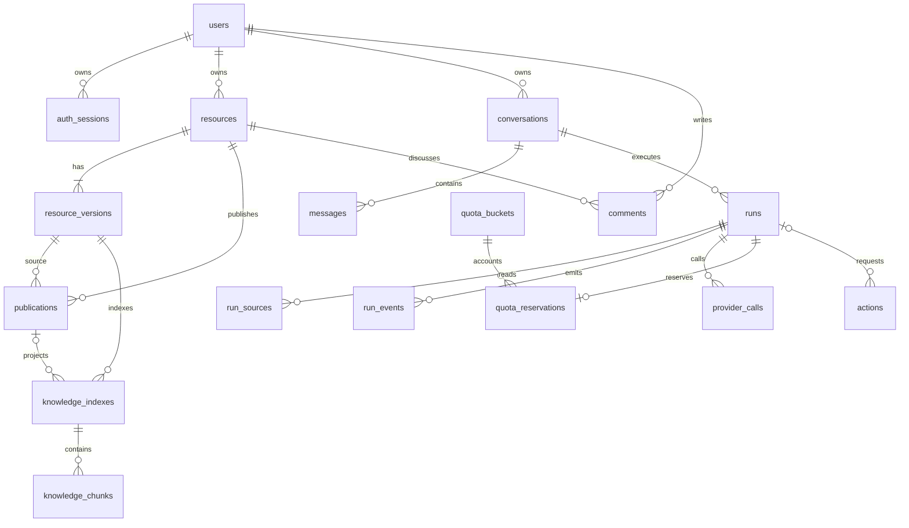

# 秋序数据库设计

归档说明（2026-10-06）：当前实现为 28 张业务表、7 个业务迁移，head `a7c19e23b806`。本文保留实体设计，实际列/约束与有意偏离请结合 [字段快照](../archive/07-database-snapshot.md) 和 [数据契约](../../backend/DATA_CONTRACT.md)；框架表使用独立 schema，不计入业务表。

版本：v1.0。这是物理建模说明，尚未执行建表。后续用 SQLAlchemy 模型和 Alembic 迁移实现，不把本文当作已经验证的迁移脚本。

## 1 存储规则

主数据库使用 PostgreSQL 加 pgvector。业务 ID 统一 UUID，由应用生成；时间为 timestamptz，保存 UTC；用户显示和日额度按 Asia/Shanghai 转换。可变对象用 bigint version 实现乐观并发控制。

以下表字段为核心字段清单。除特别说明外，每张业务表都有 created_at；可变记录还有 updated_at。业务内容、聊天与日志默认 expires_at 为 NULL，保留策略为 forever。认证凭据有效期、任务租约和临时上传过期属于运行机制，单独管理。

名称、状态和可查询字段使用有类型的列；JSONB 只承载第三方元数据、受版本化 schema 校验的参数或展示配置，不存任意可执行配置。小规模标签用规范化 text[]，暂不单建标签表。

文件与网页原始快照放在独立文件存储，数据库只保存对象键、大小和摘要；向量索引来自明确版本。原稿、公开投影、运行上下文分别管理，避免一个 public 布尔值把全部私密字段带出去。

## 2 关系概览

图为核心关系，完整的鉴权、作业、设置与保留策略表见下文。comments.resource_id 可为空，用于独立留言板。

## 3 身份与会话

### users

| 字段              | 类型                 | 说明                                   |
| ----------------- | -------------------- | -------------------------------------- |
| id                | uuid PK              | 稳定用户 ID                            |
| email_normalized  | text UNIQUE NOT NULL | 规范化邮箱                             |
| display_name      | varchar(80)          | 公开昵称                               |
| password_hash     | text NOT NULL        | Argon2id 哈希，不存明文                |
| role              | text                 | member 或 owner                        |
| status            | text                 | pending_verification、active、disabled |
| verified_at       | timestamptz NULL     | 首次验证成功时间                       |
| ai_cooldown_until | timestamptz NULL     | 首次验证成功时按当时策略计算           |
| auth_version      | bigint               | 撤销身份或密码变化时递增               |
| deleted_at        | timestamptz NULL     | 账号删除入口预留                       |

角色只能由受控引导或管理流程改变，公开注册强制 member。email_normalized 的唯一性不因软删除解除，重新使用同一邮箱需明确恢复或彻底清理流程。索引覆盖 status 与创建时间。

### auth_sessions

id UUID PK；user_id FK users；token_hash 唯一；csrf_version bigint；auth_version；created_at、last_seen_at、idle_expires_at、absolute_expires_at；step_up_expires_at NULL；revoked_at NULL。

Cookie 保存高熵原始 token，表内只存哈希。每次认证检查用户状态、auth_version、撤销与过期时间。UNIQUE(id, user_id) 支持运行的会话归属约束。索引为 token_hash、user_id 和未撤销会话的过期时间。CSRF token 由独立服务端密钥对会话 ID 与 csrf_version 签名生成，不需要保存可恢复的原始登录令牌；密钥不进数据库。

### auth_tokens

id UUID PK；user_id FK users；purpose 为 verify_email 或 reset_password；token_hash 唯一；expires_at；consumed_at；attempt_count；created_at。

使用足够长度的随机一次性链接令牌。消费采用带 consumed_at IS NULL 和 expires_at > now() 的原子更新，成功只发生一次。发邮件由 jobs 处理，邮件任务中的必要令牌采用短期加密载荷，消费或发送流程结束后移除秘密载荷，仅留状态审计。

### admin_factors

id UUID PK；user_id FK users UNIQUE；kind 固定 totp；secret_ciphertext；encryption_key_version；last_used_time_step；recovery_code_hashes JSONB；enabled_at；revoked_at。

首次绑定必须验证正确代码，记录 last_used_time_step 防止同一时间片重放；恢复码一次性消费。恢复码 JSON 中只有哈希及使用状态，不存明文。加密主密钥不放数据库或仓库。

## 4 内容 版本与公开范围

### resources

| 字段                              | 类型                            | 说明                                 |
| --------------------------------- | ------------------------------- | ------------------------------------ |
| id                                | uuid PK                         | 统一内容对象 ID                      |
| owner_id                          | uuid FK users                   | 归属站长                             |
| kind                              | text                            | article、bookmark、document、webpage |
| slug                              | varchar(160) UNIQUE             | 对外稳定标识，私密状态仍返回 404     |
| current_revision_id               | uuid                            | 当前私密版本                         |
| version                           | bigint NOT NULL                 | 每次编辑或权限修改递增               |
| acl_version                       | bigint NOT NULL                 | 公开范围变化时递增                   |
| retention_policy_id               | uuid FK retention_policies NULL | NULL 继承该类型默认策略              |
| archived_at deleted_at expires_at | timestamptz NULL                | 归档、主动删除和到期信息             |

同一资源 kind 不可改。UNIQUE(id, owner_id) 支持其他表的复合归属约束。current_revision_id 使用到 resource_versions(resource_id, id) 的可延迟复合外键，确保指向本资源版本。初始创建时在同一事务生成资源和首个版本。

索引：owner_id、kind、created_at DESC；未删除且未归档资源的部分索引；到期清理索引只覆盖 expires_at IS NOT NULL。

### resource_versions

id UUID PK；resource_id FK resources；revision_no integer；created_by FK users；title text；body_text text NULL；content_format 为 markdown 或 plain；url text NULL；private_note text NULL；tags text[]；linked_source_id FK resources NULL；source_metadata JSONB。

文件字段为 file_object_key、file_sha256、media_type、byte_size，均可为空。网页元数据包括 original_url、final_url、fetched_at、content_hash 和解析器版本，放在受 schema 校验的 source_metadata。正文的定位映射保存在知识分块或快照旁的结构化文件中。

UNIQUE(resource_id, revision_no) 和 UNIQUE(resource_id, id)。版本创建后不可编辑，修订产生新版本。linked_source_id 用于收藏关联网页资料；服务校验双方归属相同且目标 kind 正确，不因关联而继承公开权限。

各类型字段规则由服务层检查：article 必须有标题和正文；bookmark 必须有 http/https URL；document 必须有受支持文件的对象键；webpage 必须有 URL 和抓取结果或明确的待处理状态。原始 HTML 不作为可执行网页直接返回。

### publications

| 字段                               | 类型                  | 说明                                    |
| ---------------------------------- | --------------------- | --------------------------------------- |
| id                                 | uuid PK               | 一次公开版本的身份                      |
| resource_id revision_id            | uuid 复合 FK          | 绑定确切的原稿版本                      |
| publication_no                     | integer               | 该资源第几次发布                        |
| public_title                       | text                  | 对外标题                                |
| public_body public_note public_url | text NULL             | 仅包含明确选择的字段                    |
| public_tags                        | text[]                | 已选择公开的标签                        |
| public_fields                      | text[]                | title、body、note、url、tags 的合法子集 |
| ai_enabled                         | boolean DEFAULT false | 允许进入普通用户 AI 资料范围            |
| raw_download_enabled               | boolean DEFAULT false | 允许读取这一版本的原文件                |
| published_by                       | uuid FK users         | 发布者                                  |
| published_at revoked_at            | timestamptz           | 当前发布或历史撤回状态                  |

revoked_at 默认 NULL，published_at 必须有值。UNIQUE(resource_id, publication_no)；UNIQUE(resource_id, revision_id, id) 支持索引表的严格引用；部分唯一索引 UNIQUE(resource_id) WHERE revoked_at IS NULL，确保一个资源只有一个现行公开版本。

公开字段不在 public_fields 中时，其对应列必须为空或空数组，由 CHECK 或触发器配合服务校验。公开查询还要连接 resources，要求未归档、未删除。不再在 resources 另存 public 布尔值，避免两份状态冲突。

公开权限变更建立新 publication 或撤回旧 publication；历史记录不自动对外开放。允许下载原件代表整个原件将可访问，发布前明确预览，不能用只公开摘要的授权开启原件下载。

## 5 知识索引

### knowledge_indexes

id UUID PK；resource_id、revision_id 复合 FK；publication_id NULL；scope 为 owner 或 public；embedding_provider；embedding_model；embedding_dimension integer；generation integer；status 为 queued、building、ready、failed、retired；is_active boolean；content_hash；error_code NULL；created_at。

scope=public 必须有 publication_id，并用复合外键确保 publication 绑定同一资源与 revision；scope=owner 时 publication_id 必须为空。UNIQUE(id, embedding_dimension) 可供向量维度检查。

每个私人 revision 最多一个活动索引；每个 publication 最多一个活动索引，分别用部分唯一索引约束。active 索引必须 ready。重建完成后事务性切换活动版本，查询始终过滤已授权、ready 且活动的索引。

### knowledge_chunks

id UUID PK；index_id FK knowledge_indexes；chunk_no integer；content_text text；locator JSONB；token_count integer；embedding vector(1024)；created_at。

UNIQUE(index_id, chunk_no)；B-tree(index_id)。locator 记录 PDF 页码区间、DOCX 章节段落或网页投影内偏移。首版精确向量查询，不建近似索引。查询按 index_id 先过滤权限，不先全库召回再在应用层删掉越权结果。

当前列维度固定为 1024；knowledge_indexes.embedding_dimension 也必须为 1024，由 CHECK 与入库校验保证。更换维度必须走显式迁移或新表，不把不同模型、不同维度向量混查。选择百炼具体模型后以所选 API 的实际输出验证维度。

## 6 留言与举报

### comments

id UUID PK；author_id FK users；resource_id FK resources NULL；parent_id FK comments NULL；client_id UUID；body text；version bigint；status 为 pending、approved、rejected、hidden；moderated_by FK users NULL；moderated_at；deleted_at。UNIQUE(author_id, client_id) 用于提交去重，同标识不同正文返回冲突。

resource_id 为空表示留言板。回复必须与父留言属于同一资源，并限定首版只有一级回复，服务校验；禁止 parent_id=id。数据库触发器或复合外键校验父子资源一致，不能只在前端校验。

公开读取要求 status=approved、未删除；文章评论还要求文章当前公开。修改已审核正文重新进入 pending，不把新内容继续当作已审核内容。

索引：(resource_id, status, created_at, id)、(author_id, created_at)、parent_id。

### reports

id UUID PK；reporter_id FK users；comment_id FK comments；reason text；status 为 open、resolved、dismissed；handled_by FK users NULL；resolution_note NULL；resolved_at。

每个用户对同一留言最多一条未处理举报，使用 WHERE status='open' 的部分唯一索引。普通用户只能报告已公开或自己可见的留言，不能枚举私密评论。

## 7 对话 运行与来源

### conversations

id UUID PK；user_id FK users；mode 为 public 或 owner；title；next_message_seq bigint；version；retention_policy_id FK NULL；deleted_at；expires_at。

mode 创建后不可修改，owner 模式必须属于站长。公开资料模式的 conversation 本身仍是私密记录。UNIQUE(id, user_id) 支持 runs 的复合归属外键。索引：(user_id, updated_at DESC, id)，列表仅返回本人未删除会话。

### messages

id UUID PK；conversation_id FK conversations；run_id FK runs NULL；seq bigint；role 为 user 或 assistant；body_text；content_version bigint；status 为 composing、complete、interrupted、hidden；client_message_id UUID NULL；created_at。

UNIQUE(conversation_id, seq)；对非空 client_message_id 建 UNIQUE(conversation_id, client_message_id)。正文累计更新仅限正在生成的 assistant 消息；完成后修订通过新消息表示。工具协议消息保存在运行状态中，不混入普通对话展示。

run_id 与 conversation_id 使用复合外键，保证同属会话。一次 run 可有补充信息前后的多个可见消息；输入与当前输出指针保存在 runs。删除会话时处理整组消息与运行依赖。

### runs

| 字段                                | 类型                  | 说明                                                                                                     |
| ----------------------------------- | --------------------- | -------------------------------------------------------------------------------------------------------- |
| id                                  | uuid PK               | 一次问答或助手任务                                                                                       |
| user_id conversation_id             | uuid 复合 FK          | 必须属于同一用户                                                                                         |
| idempotency_key                     | varchar(128)          | 用户范围内唯一                                                                                           |
| request_hash                        | text                  | 规范化业务请求哈希                                                                                       |
| input_message_id current_message_id | uuid NULL             | 同会话消息指针                                                                                           |
| auth_session_id                     | uuid FK auth_sessions | 本次运行授权的会话                                                                                       |
| status                              | text                  | queued、running、waiting_input、waiting_approval、waiting_auth、succeeded、failed、cancelling、cancelled |
| scope_epoch                         | bigint                | 建立上下文时的全站权限版本                                                                               |
| checkpoint_thread_id                | text                  | 服务端生成的框架线程标识                                                                                 |
| next_event_seq                      | bigint                | 持久事件的下一个序号                                                                                     |
| execution_generation                | bigint                | E8 增量迁移；>=1，等待/恢复推进，正式结果提交的执行 fencing                                              |
| config_snapshot                     | jsonb                 | 已校验的模型和预算版本，不含密钥                                                                         |
| input_request                       | jsonb NULL            | 等待补充信息的 id、prompt、options、expires_at、consumed_at、answer_hash 与 answer_message_id            |
| started_at finished_at              | timestamptz NULL      | 生命周期                                                                                                 |
| error_code                          | text NULL             | 结构化错误码                                                                                             |

UNIQUE(user_id, idempotency_key)。UNIQUE(id, conversation_id) 供 messages 复合引用；UNIQUE(conversation_id) 的部分索引只包含非终态，保证会话中没有两次同时推进的任务。用户并发上限用 users 行锁后计数，支持配置，不用固定为 1 的全局唯一索引。

input_message_id 和 current_message_id 的外键可延迟到提交时检查，必须指向同一 conversation。auth_session_id 与 user_id 复合引用 auth_sessions；恢复时只能换成同一用户当前有效会话。中途等待补充信息仍是同一 run，不再次创建问答计数。

input_request 由版本化 schema 校验，回答正文存入 messages。锁定 run 后原子消费等待项并保存 answer_hash；相同等待项的同答案重试返回原结果，不同答案返回 409。新一轮澄清生成新 ID，历史待答元数据留在 run_events。客户端不能创建等待项或改写其有效期。

### run_events

主键(run_id, seq)；type text；payload JSONB；created_at。payload 仅含状态、对象 ID、message_id、content_version 等必要元数据，不重复保存消息全文、密钥或文件原文。

message.snapshot 事件回放时从仍可读取的 messages 构造最新内容；同 message_id 只保留最新展示版本。事件序号由 runs.next_event_seq 原子分配，状态变更和事件插入同事务提交。

### run_sources

id UUID PK；run_id FK runs；context_generation bigint（E8，>=1，默认 1）；source_type 为 resource 或 web；resource_id、revision_id、publication_id 可空；index_id、chunk_id 可空；observed_acl_version；locator JSONB；web_url、web_title、fetched_at 可空；excerpt text NULL；source_key text。

当前模型输入闭包仅装配当前 execution_generation 的来源，source_key 包含代际前缀以保留重复读取的原始身份。
等待/恢复在同一事务复制已验证来源到新代际；权限修改后的重建标记 manifest 不完整，重新选择获准文本。
旧代际来源仍然保存，用于历史消息、摘要、记忆追溯；不能因为切换代际而删除依赖证据。

resource 类型必须有资源和版本的复合外键；public 模式还必须指向当时的 publication。web 类型禁止填入无意义资源外键，只有站长运行可创建。索引 UNIQUE(run_id, source_key)。

这是所有实际输入模型的来源依赖表，包括通过历史生成消息、摘要或记忆间接带入的依赖；不只记录最终展示引用。API 的 citation_id 就是本表 id，返回前检查 run 归属和来源的当前权限。

### conversation_summaries

id UUID PK；conversation_id FK conversations；upto_message_seq bigint；body_text；scope_epoch bigint；status 为 active、stale；created_at。

同会话最多一个 active 摘要。摘要依赖为该会话截至 upto_message_seq 的消息关联 runs 及其 run_sources；需要恢复或 scope_epoch 变化时重新检查这些依赖。不能只用摘要文本继续对话而跳过来源检查。

### memories

id UUID PK；user_id FK users；kind 为 preference 或 fact；content_text；origin_run_id FK runs NULL；origin_message_id FK messages NULL；confirmed_at；version；deleted_at；expires_at NULL。

首版仅站长明确要求记住时创建。来源 run 与 message 必须属于同一用户；对应资源依赖沿 run_sources 追溯。手工输入记忆可无来源，但记录授权 action。普通用户的自动性格画像不建表、不生成。

### LangGraph 自带状态

检查点与相关存储使用独立 schema，例如 agent_state，表结构由固定版本的持久化适配器维护，不能在本文猜测列名。应用拥有明确的 conversation 到 checkpoint_thread_id 映射。

角色或权限变化不能直接信任旧 checkpoint。删除会话和彻底清理资料时要调用适配层删除或重建相关状态，防止业务表已删除而恢复数据仍可读取。

## 8 操作 额度与供应商调用

### actions

id UUID PK；actor_id FK users；auth_session_id FK auth_sessions；run_id FK runs NULL；type；target_resource_id FK resources NULL；expected_version bigint NULL；parameters JSONB；parameters_hash；authorization_kind 为 explicit_request 或 confirmed_preview；authorization_message_id FK messages NULL；status；requires_confirmation；expires_at；confirmed_at；executed_at；idempotency_key；result JSONB；error_code。

status 为 proposed、awaiting_confirmation、ready、running、succeeded、failed、cancelled、expired。参数与目标通过类型 schema 校验，身份不能从 parameters 读取。操作一旦确认，不允许原地修改参数。UNIQUE(actor_id, idempotency_key)。

数据库内修改与 succeeded 状态同事务完成。result 存结果对象 ID 和状态，不复制全文私人记录。未明确授权的新生成内容不能因 requires_confirmation 被模型设为 false 而直接公开；该字段由服务规则决定。

### quota_buckets

id UUID PK；user_id FK users；window_start、window_end timestamptz；timezone text；used integer DEFAULT 0；reserved integer DEFAULT 0；policy_version bigint。

UNIQUE(user_id, window_start)；CHECK window_end > window_start、used >= 0、reserved >= 0。限额从当前受控配置读取，不用历史桶内静态约束阻止站长降低额度。受理时在同一事务加锁并比较 used + reserved 与当前限额。

### quota_reservations

id UUID PK；run_id FK runs UNIQUE；bucket_id FK quota_buckets；amount integer 固定 1；status 为 reserved、charged、released、refunded；charged_at、settled_at NULL。

状态转换和桶计数同事务进行：reserved→charged 为 reserved-1、used+1；reserved→released 为 reserved-1；charged→refunded 为 used-1。禁止重复补偿，CHECK amount=1；run 用户必须与桶用户一致，服务与约束触发器校验。

计数桶不保存费用。午夜后重连仍使用原 reservation。软删除会话不影响历史用量统计；彻底清理删除正文、标题、摘要、来源摘录、消息事件内容和检查点，但保留无内容的 conversation 与 run 墓碑 ID 供用量外键引用。保留最小用户归属和计数时间，不用外键级联删除历史扣次记录。账号彻底销号的匿名化流程不在首版范围。

### provider_calls

id UUID PK；run_id FK runs NULL；job_id FK jobs NULL；provider；model；purpose；attempt_no；external_request_id NULL；status 为 prepared、dispatched、succeeded、failed、unknown；input_tokens、output_tokens、search_units；estimated_cost、actual_cost numeric(20,8) NULL；currency varchar(3) NULL；started_at、finished_at；error_code。

调用必须关联 run 或 job，必要时两者都有。unknown 不能当作零费用。不同币种不能直接相加；真实密钥、请求鉴权头和完整提示词不写入此表。按 provider、created_at 与 run_id 建索引。

## 9 作业 设置 保留与审计

### rate_limit_buckets

scope_hash text；policy_key text；window_start timestamptz；window_end timestamptz；hits integer；expires_at timestamptz。主键(scope_hash, policy_key, window_start)，CHECK hits >= 0 且 window_end > window_start。

scope_hash 是按策略对用户 ID、来源 IP 或规范化邮箱计算的服务端 HMAC，不存可用于枚举账号的明文邮箱。分别限制 AI 受理、登录尝试与邮件发送；同请求涉及多个限制时按固定键序加锁。使用 PostgreSQL 原子更新，跨 API 进程一致。它是短期防滥用计数，窗口结束后可清理；不替代永久保留的问答额度或操作审计。

### jobs

id UUID PK；kind；actor_id FK users NULL；auth_session_id FK auth_sessions NULL；run_id FK runs NULL；resource_id FK resources NULL；payload JSONB；idempotency_key UNIQUE；status；phase；attempts；max_attempts；available_at；lease_token UUID NULL；lease_expires_at；heartbeat_at；progress；result JSONB；error_code。

status 为 queued、running、waiting_auth、succeeded、failed、cancelling、cancelled。phase 为 fetching、parsing、embedding 等业务阶段，可空。领取索引为(status, available_at)，另建运行租约到期索引。

worker 使用 FOR UPDATE SKIP LOCKED 领取任务，提交租约后执行实际工作。结果更新要求匹配 lease_token，防止过期 worker 覆盖新结果。需要额外验证且验证过期的任务转 waiting_auth，站长验证后可恢复。

### settings

key text PK；value JSONB；schema_version；version bigint；updated_by FK users NULL；updated_at。仅支持后端白名单配置，例如 ai_limits、assistant_theme、provider_selection 与 content_acl_epoch。

用户只能修改暴露给管理界面的安全字段；密钥、文件系统任意路径和可执行代码不进入可由 Agent 修改的配置。content_acl_epoch 属于内部字段，只由公开范围事务递增，不能被站长聊天任意指定数值。

### retention_policies

id UUID PK；scope 为 resources、conversations、audit_events 或 runtime_logs；resource_kind NULL；mode 为 forever 或 ttl；ttl_days integer NULL；anchor 为 created_at 或 updated_at；applies_from；include_existing boolean；version；is_active；created_by FK users。

CHECK：forever 时 ttl_days IS NULL；ttl 时 ttl_days > 0。同一 scope 和 resource_kind 仅一个 active 策略，NULL 值按同一个分类处理，可用 PostgreSQL 的 NULLS NOT DISTINCT 或拆分部分唯一索引实现。

当前默认记录全部 forever。给历史数据设置 expires_at 是可预览的独立作业，不能只修改策略行就默默开始删除。记录删除的生效规则与物理清理规则分别定义。

### audit_events

id UUID PK；actor_id FK users NULL；action_id FK actions NULL；resource_id FK resources NULL；event_type；result；before_version、after_version NULL；request_id；metadata JSONB；created_at；expires_at NULL。

只追加，不原地修改历史事实。metadata 不存密码、token、完整私人文档或模型上下文；主要保留对象 ID、字段名、状态和版本。默认永久，主动清理按明确策略进行。

应用运行日志单独归档，字段包含 request_id、run_id、错误码和耗时，默认永久；不为全部原始日志新建通用业务表。后续可接外部日志存储，当前只保留接口。

## 10 关键事务与一致性

### 受理一次问答

锁定 users 与 conversations → 处理相同幂等键 → 锁定当日 quota_bucket → 校验并发与余额 → 写 run、messages、reservation、job → 提交。任何一步失败整笔回滚。

run 第一次派发模型调用时，同一事务把 reservation 从 reserved 转 charged，并写 provider_call 的 dispatched 标记。网络调用在事务外执行；未知结果单独处理，不能以重启为由重复计次。

### 发布或收回内容

锁定资源并检查 expected_version → 写公开投影或撤销现行 projection → 递增资源 acl_version 与全站 epoch → 写 action、audit_event、索引 job → 提交。公开读取永远校验现行 publication，因此队列延迟不会扩大权限。

### 软删除与彻底清理

先标记 deleted_at 并撤回公开权限，立即停止读取。后台列举 resource_versions、knowledge_indexes、chunks、run_sources、summary 和 memory 依赖，标记相关运行状态失效。确认彻底清理后删除对象文件和派生内容，保留不含全文的必要审计与用量凭证。

外部文件删除无法参与 PostgreSQL 事务，采用可重试的清理 job。失败时保留不可访问的待清理状态，不能先宣布文件已彻底删除。

## 11 迁移与验证顺序

第一批迁移建立 users、auth_sessions、auth_tokens、admin_factors、rate_limit_buckets、settings。第二批建立 retention_policies、resources、resource_versions、publications、comments、reports。第三批建立 conversations、runs、messages、actions、quota_buckets、quota_reservations、jobs、provider_calls、audit_events、run_events。第四批建立索引、来源、摘要、记忆与框架状态。

循环外键在相关表创建后补充，并明确可延迟检查。先建表后加约束不等于允许生产数据长期缺少约束；迁移验收必须验证约束已安装。

实现时使用真实 PostgreSQL 与 pgvector 验证外键、唯一约束、并发扣次、事务回滚和向量维度。SQLite 不能代替这些验收。当前没有运行数据库，因此本文不宣称这些约束已经通过执行测试。
