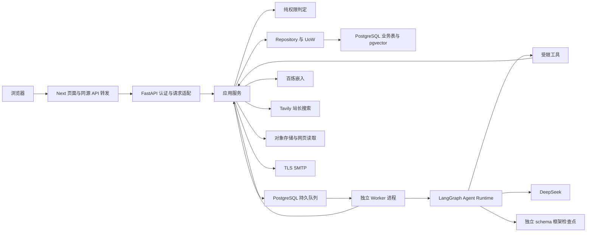
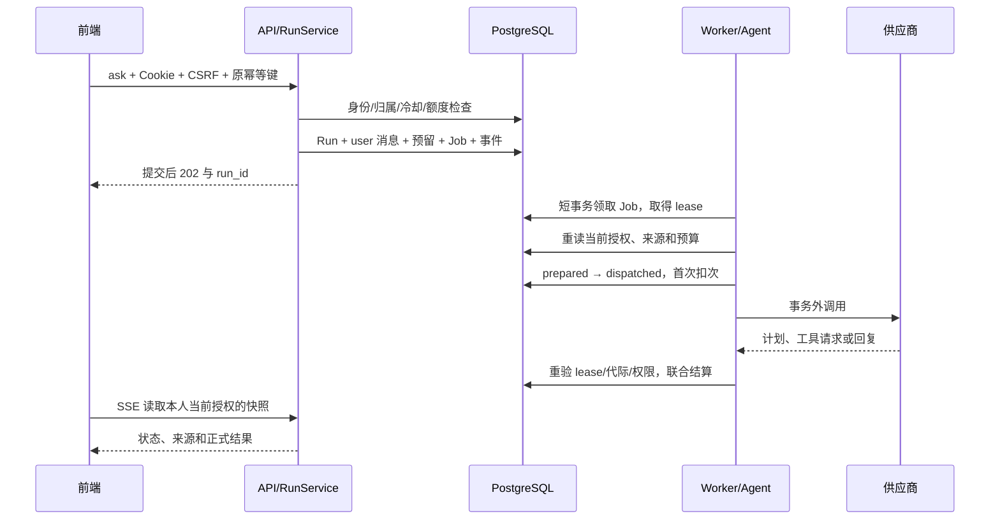

# 02 架构与核心链路

## 部署形态与模块职责

前端与后端独立运行，业务后端采用模块化单体。HTTP API 与 Worker 是不同进程入口，Agent 是由 Worker 调用的后端模块；三者共享业务服务、Repository、纯 Policy 和基础设施。

图中的供应商和存储边表示端口调用，网络/文件操作发生在数据库事务之外。Next 仅渲染、处理交互并转发请求，不承担第二套身份、业务或 Agent 实现。

| 层           | 核心职责                                   | 代表代码                                   |
| ------------ | ------------------------------------------ | ------------------------------------------ |
| API          | 解析、Cookie 身份、Origin/CSRF、响应与错误 | `api/deps.py`、`api/chats.py`              |
| Auth         | 密码、会话、邮件令牌、TOTP                 | `auth/service.py`、`auth/security.py`      |
| Policy       | 对显式身份和事实返回允许/拒绝；不做 I/O    | `policies/policy.py`、`facts.py`           |
| Service      | 编排用例、重读权限、组织短事务             | `services/runs.py`、`publication.py`       |
| Repository   | SQL 范围、行锁、CAS、UPSERT、状态转换      | `repositories/runs.py`、`quota.py`         |
| UoW          | 统一 commit/rollback 和 Task 所有权        | `db/session.py`                            |
| Agent        | 装配当前上下文、规划、调用白名单工具       | `agent/runtime.py`、`graph.py`、`tools.py` |
| Worker       | 领取、续租、执行和有界维护                 | `workers/core.py`、`bootstrap.py`          |
| Port/Adapter | 外部协议与有限结果；不决定权限             | `providers/`、`storage/`、`knowledge/`     |

上述代码均位于 [backend/src/autumn_backend](../../backend/src/autumn_backend)。允许 `workers → agent/services`，禁止 `agent → workers`、`services → agent`、`services → workers`。禁止方向已有架构约定，完整 import-linter CI 闸门尚待 I 阶段。

## 问答受理与执行

一次 ask 对应一个 Run，不对应一次模型请求。内部规划、检索后再规划、工具循环及人工等待恢复共享 Run 的预算和额度预留。HTTP 重试保留原键和请求摘要，SSE 重连只读事件，不重新发送 ask。

模型计划必须符合严格 JSON schema。计划工具协议不写成正式 assistant 消息；只有通过最终提交闸门的回复才成为业务结果。当前回复在模型完整返回后提交，SSE 的可重连架构不能等同于逐 token 生成。

## 收藏、手记与管理动作

1. 站长进入固定 owner 模式会话并完成当前 TOTP/恢复码验证。
2. 模型只能调用 `propose_bookmark`、`propose_note` 或 `propose_action` 生成固定结构预览。
3. Action 绑定账号、Run、实际用户消息、目标和参数摘要；预览期间不创建资源。
4. 页面展示具体变更，用户点击确认。确认校验 Action 版本、目标内容/ACL 双版本、当前权限及来源。
5. 确认提交 `ready` 并入队 `action.execute`。Worker 在短事务中执行已确认数据库命令，结果、Action 成功、审计及 Job 完成共同提交。
6. 关联 Run 切换执行代际，重新装配上下文，再报告实际保存结果。默认新建私人资源；公开需独立选择字段并确认。

`waiting_input` 表示缺少业务信息，`waiting_approval` 表示等待批准具体变更。补充答案不能替代操作确认；有固定选项时提交原选项值，自由输入“确认”可能不满足选项 schema。

产品早期设想允许低影响明确指令直接执行；当前 Agent 的写入统一采用人工预览。页面明确撤回可以直接调用现有事务服务。这是当前实现边界，不是自然语言中的一句“好”获得所有写权限。

## 知识入库与检索

文件先经过扩展名、MIME、签名和大小检查，物理写入 staging 后，数据库登记 FileObject 与转正任务。网页读取限制公开 HTTP(S)、公网地址、跳转与响应大小。PDF 提取可选中文字，DOCX 读取 ZIP/XML 段落，不运行文档中的指令。

正文形成不可变版本，再分块和生成 1024 维向量。私人索引基于本人当前资料；公开索引只从 Publication 白名单投影生成。每批百炼调用有账本，所有片段构建完成后才激活新索引，不能启用失败的部分批次。

检索先在 SQL 中限制当前允许的活动索引，再进行精确向量排序。返回给模型的全部片段登记来源闭包，绑定 revision、publication、ACL、index/chunk 和位置。历史回复、摘要与记忆的间接依赖也必须复查。已注册 HTTP 上传/导入入口的缺口见 [接口快照](08-api-snapshot.md)。

## 邮件链路

注册/找回服务在同一事务登记一次性令牌哈希和 `auth.email` Job，任务中仅保存必要的加密凭据。Worker 在当前租约下重读用途、有效期和哈希，事务外调用 SMTP_SSL，随后结算调用账本、任务与密文清理。

SMTP 密码为空时不注册发送处理器。提交结果不明确时保留 unknown，同一任务不会自动重发。注册返回受理不等于已发送，SMTP 接受也不等于最终收件成功。真实收件仍待本地验证。

## 重启、失权和恢复

框架检查点只保存 Run ID、执行代际、步骤与路由。恢复从业务数据库重建身份、权限、当前正文和来源；不能从旧节点位置跳过授权。最近历史默认最多 12 条完整消息，失效依赖不进入模型。

当前权限或租约失效后，取消执行并尽力停止上游。已经发出的网络请求可能仍收费；迟到结果不能提交正式消息。文件/索引 waiting_auth 可受控换绑同一站长的新会话；已确认动作不能借这一入口跳过重新预览与确认。

相关细节见 [G](../../backend/G_STAGE_AGENT.md)、[H](../../backend/H_STAGE_WORKERS.md) 与 [E 服务契约](../../backend/E_STAGE_SERVICES.md)。
