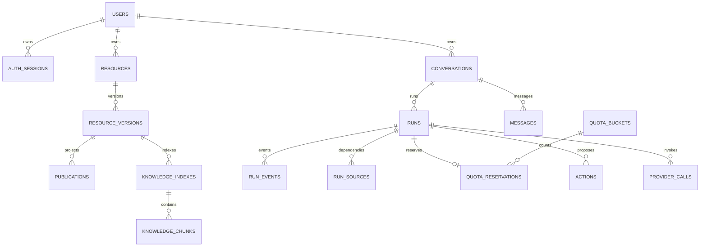

# 03 数据库与一致性

## 28 张表解决什么问题

| 分组       | 表                                               | 保存的事实                                 |
| ---------- | ------------------------------------------------ | ------------------------------------------ |
| 身份       | users、auth_sessions、auth_tokens、admin_factors | 账号、会话哈希、一次性令牌和加密第二因素   |
| 入口配置   | rate_limit_buckets、settings                     | 短期限速及带版本的全站配置/权限 epoch      |
| 内容       | resources、resource_versions、publications       | 主体、不可变原稿和显式公开投影             |
| 文件与保留 | file_objects、retention_policies                 | 可变物理文件状态及保留策略                 |
| 互动       | comments、reports                                | 留言、一级回复、审核和举报                 |
| 聊天执行   | conversations、messages、runs、run_events        | 本人固定模式会话、正文、执行和事件序列     |
| 动作       | actions                                          | 具体命令、双版本、参数摘要、确认和结果     |
| 额度       | quota_buckets、quota_reservations                | 每日计数桶和每 Run 一次的预留/结算         |
| 后台与成本 | jobs、provider_calls、audit_events               | 持久任务、外部尝试和只追加审计             |
| 知识       | knowledge_indexes、knowledge_chunks、run_sources | 索引代际、1024 维分块及实际模型来源        |
| 长期上下文 | conversation_summaries、memories                 | 可失效摘要和明确记忆；默认自动装配仍待扩展 |

字段全集和物理约束在 [07 字段快照](07-database-snapshot.md)。LangGraph 的框架表在独立 `autumn_checkpoints` schema，不计入 28 张业务表。

该图是主要关系示意，省略可空绑定、复合键和其他表；不能替代字段快照中的真实外键。

## 不同版本不能混用

| 标识                           | 含义                         | 拦截的风险                     |
| ------------------------------ | ---------------------------- | ------------------------------ |
| resources.version              | 私人内容/metadata 的并发版本 | 旧编辑覆盖新内容               |
| resources.acl_version          | 单资源可见性版本             | 旧预览重新公开已撤回内容       |
| settings.content_acl_epoch     | 全站内容权限变化标识         | 继续使用旧资料范围             |
| runs.version                   | Run 状态并发版本             | 旧状态提交覆盖恢复后的状态     |
| runs.execution_generation      | 一次合法执行上下文的代际     | 旧 Worker/旧规划向新执行写结果 |
| run_sources.context_generation | 来源属于哪一代上下文         | 将历史来源误当成当前授权       |
| messages.content_version       | 累计正文快照版本             | SSE 旧快照覆盖新正文           |
| actions.version                | 预览对象自身并发版本         | 重复/过期确认推进错误动作      |
| schema_version                 | JSON 结构版本                | 用旧 schema 解释新参数         |

发布和撤回提高 ACL 与全站 epoch，私人原稿编辑追加不可变 revision。不能为了“有个版本变了”就把所有版本一起递增。归档操作还有自己的内容/ACL 语义，具体以资源 Repository 为准。

## UoW 与短事务

一个 UoW 是一个原子数据库阶段，绑定一个 AsyncSession 和 Repository 集合。正常退出 commit，异常 rollback，最后关闭会话；实例只能进入一次并属于同一 asyncio Task。工厂可以共享，事务实例不能由并发 handler 与 heartbeat 共用。

Repository 可以 flush，不负责 commit。业务服务组织多个仓储操作，使 Run、消息、额度和 Job 一起提交。`active_uows` ContextVar 在外部端口检查，子 Task 继承这一标记，不能通过另开协程绕过事务外 I/O 约束。

统一执行形状是：**事务 1 重验资格并登记派发 → 事务外网络/文件 → 事务 2 重验资格并提交结果**。模型成功而事务 2 失权时不能保存正式回复，但外部费用事实仍保留。

## 幂等与并发仲裁

| 对象     | 仲裁身份/机制                                                  | 同键异语义                   |
| -------- | -------------------------------------------------------------- | ---------------------------- |
| Run      | UNIQUE(user_id, idempotency_key) + 稳定请求摘要                | 409 冲突                     |
| 留言     | UNIQUE(author_id, client_id) + 原始 request_hash               | 冲突；编辑不能改写原请求身份 |
| Action   | 全列不可空 UNIQUE(actor_id, idempotency_key) + parameters_hash | 冲突                         |
| 额度预留 | UNIQUE(run_id)，固定 amount=1                                  | 不能换桶或变成第二次预留     |
| Job      | 唯一任务键 + SKIP LOCKED 领取                                  | 原任务或冲突，不重复入队     |
| 外部调用 | UNIQUE(logical_call_key, attempt_no)                           | 逻辑身份和物理尝试不能混淆   |

“先 SELECT，没有再 INSERT”不能作为最终防重，因为两个事务可以同时读到没有。唯一约束、定向 ON CONFLICT 和稳定摘要共同区分原请求重试与不同请求。Run 的同会话非终态唯一是另一种冲突，不能被吞成幂等成功。

CAS 是 `UPDATE ... WHERE version=expected RETURNING ...` 或受控旧状态条件的数据库仲裁。0 行必须被解释为不存在、状态变化或版本冲突，不能无条件返回成功。SQL 错误后事务需要 rollback，不能继续把已经失败的事务当正常连接使用。

## 跨行不变量与数据库陷阱

- Publication 的 `(resource_id, revision_id)` 复合外键保证公开的是同一资源版本；序号只需在资源内唯一。
- 一资源至多一个未撤回 Publication、一会话至多一个非终态 Run，用部分唯一索引表达。
- 父留言存在、没有更上层 parent、同资源且未删除，需要锁定父记录并在事务中复核；单行 CHECK 无法完成这些判断。
- PostgreSQL CHECK 只拒绝 FALSE，涉及可空列时必须显式写 NULL 安全逻辑。TTL 模式缺天数不能让表达式算出 NULL 而漏检。
- 复合外键的 `ON DELETE SET NULL` 可能把包含 NOT NULL 的整组列置空。当前实现使用合适的 NO ACTION/主动摘引用，记忆来源的单列 SET NULL 则保留不同语义。
- 可延迟外键默认在提交时检查；用例中只检查 flush 不能证明最终约束成立。

这些问题在早期设计评审和独立探针中实际出现过，详见 [原始评审](history/秋序后端架构评审与知识点详解_v1.0.md) 与 [数据契约](../../backend/DATA_CONTRACT.md)。

## 额度状态与费用状态

新 Run 预留一次；第一次 chat/tool 模型派发时预留转 charged。派发前取消可释放；已经派发后停止不能走“未消费”释放。可信故障可走幂等退款，调用账本不删除。

额度按 Asia/Shanghai 自然日，数据库时间统一 UTC。Reservation 永远绑定受理时原桶，跨午夜恢复不会改桶或再次扣次。查询当前今日额度和查询旧 Run 的原桶额度是两个接口语义。

问答次数是产品限额，token、搜索单位、嵌入批次和金额是供应商成本。unknown 的 actual_cost 保持未知，不写成 0；不同币种不直接相加。当前有调用预算和账本，不宣称已完成精确货币预算预占。

## lease、代际和当前授权

Worker 领取 Job 后得到服务端 token，heartbeat 和 finish 必须同时匹配 running、token 和数据库时钟下未过期的租约。过期 token 不能靠续租复活。

旧 Worker 可能仍拿到外部结果，所以**业务写入、当前 lease、执行代际、权限及 Job.finish 必须在同一提交事务复核**。只在最后单独 finish 拒绝旧 token，无法撤销之前已经提交的业务写入。

队列允许至少一次处理，已知可幂等任务可有限重试；dispatched/unknown 外部调用不能自动重放。稳定外部键有助于仲裁，但不代表每个供应商支持恰好一次调用或计费。

## 公开投影与删除

公开数据只从白名单 Publication 投影读取，不从完整私人原稿返回后让前端隐藏。公开索引也独立构建；私人原稿后续修改不会改变现行公开版本。

撤回、软删除或失权先阻断当前读取，再异步撤下索引和清理派生内容。任务结束不明确时保留状态待收敛，不能把公开读取的安全性依赖于物理清理完成。永久保存指默认业务历史不会按年龄自动删；认证令牌有效期、staging 孤儿清理和无效派生索引清理仍独立运行。

## 迁移证明的层次

1. 空库 base→head：证明迁移可以安装。
2. Alembic check：证明可比较的模型结构没有漂移，不覆盖全部 CHECK/触发器语义。
3. Catalog 核对：名称、外键、部分索引谓词、向量维度及触发器。
4. 真实 PostgreSQL 正反例、独立 SQL 探针与并发用例：证明约束和仲裁实际工作。

当前 7 个迁移文件的 head 为 `a7c19e23b806`；这是代码链，不等于任何正在运行的数据库都已应用。后续改模型应新增增量迁移，不修改已应用历史来掩盖差异。
